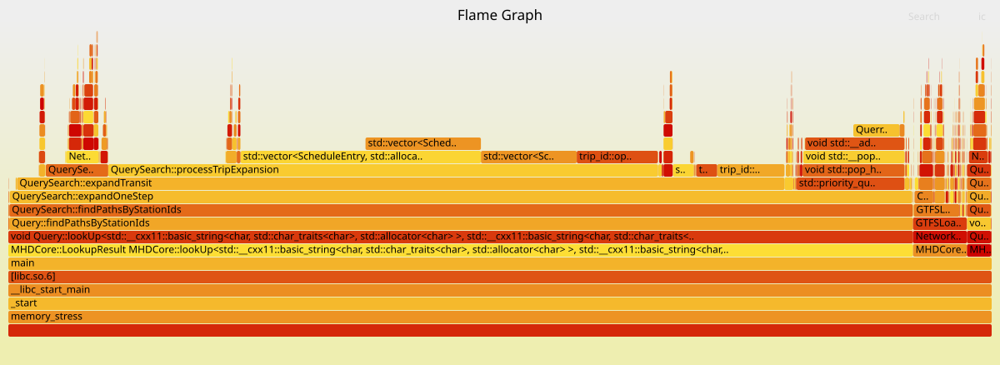

# Implementation of the search algorithm

### Station
Stations are loaded from `stops.txt` or `stops.json` and stored in `std::map<uint32_t, StationPtr>` plus a sorted `std::vector<std::pair<uint32_t, Location>>` (`stationsByLocation`) for location-based lookup

Each `Station` stores:
- `id` - internal station id
- `name` - station name, stored in a fixed char buffer
- `lines` - vector of `line_id` values for lines that serve the station
- `location` - latitude and longitude (`Location`)
- `platforms` - GTFS platform ids associated with the station

### Line and schedule index

Schedules are stored per-line in `lineSchedules` (a `std::vector<std::vector<ScheduleEntry>>`) and I use multiple structures like `stationIndex`, `tripStopIndex` and `nextTripScheduleIndex` to achieve fast lookups

`ScheduleEntry` contains:
- `arrival_time` - seconds from midnight (scheduled arrival)
- `departure_time` - seconds from midnight (scheduled departure)
- `trip` - `trip_id` (FNV hash + assigned `line`)
- `station_id` - internal station id
- `stop_sequence` - sequence index within the trip
- `day_offset` - 0 or 1 for midnight wrap

Each line's schedule vector is sorted by time; `nextTripScheduleIndex` provides quick jump points to the next stop index for the same trip.

### Trip and service metadata
- `tripServiceInfo` - mapping from trip hash to `service_id` (service date range and weekday mask stored in `serviceInfoVec`)
- `tripToLine` - mapping from trip hash to `line_id` (used to assign trips to lines)
- `realtimeDelays` - per-trip delay in seconds fetched by `fetchRealtimeDelays()` when in online mode and Golem API only

`calendar_dates.txt` is parsed into added/removed service exceptions (`CalendarDateExceptions`) so trip availability is checked against both weekday patterns and date-specific overrides.

## Search state

### Priority queue entry
The search uses a min-heap of `PQEntry` values:
- `station` - current station id
- `day` - day of week (0..6) starting Monday
- `time` - arrival time in seconds from midnight
- `trip` - `trip_id` (empty `trip_id` means not on a vehicle)
- `changeNumber` - number of transfers made
- `walkSegments` - number of walking segments used so far
- `entry_id` - index into the `pathEntries` vector for path reconstruction
- `isWait` - marks deferred waiting entries so they bypass dominance pruning

### Search policy
The comparator currently supports two `SearchPriority` modes:
- `LeastTransfers`: prefers fewer transfers, then fewer walking, then earlier day/time
- `QuickestTime`: prefers earlier day/time, then transfers and walking

## Search algorithm

The search starts from a station and a lookup time and calls `expandOneStep()` in a loop until the target station is reached or limits are hit. Each step expands the current state by:
- adding walking edges from the current station (if not already walking)
- adding transit edges for candidate boardings from the current station
- adding a waiting entry to allow later boarding opportunities
  - to avoid overwhelming the queue with wait entries, a `lastWaitCache` tracks the last wait entry per `(station, day)` and only adds a new one if the current time is sufficiently later than the last wait time
- I also implemented a special handling for the `LeastTransfers` priority mode where I allow double the number of expansions to give the search more room to find routes with fewer transfers, at the cost of potentially longer search times on large networks. This is controlled by checking the `SearchPriority` and adjusting the `maxExpansions` accordingly

### Walking expansion
Walking edges are precomputed in `Query::buildWalkingIndex()` using `stationsByLocation`, `getParentStation()` to collapse platforms, a `walkingFactor` and `maxWalkingDistance`. The `walkingIndex` maps a station id to a vector of `WalkEdge { station, seconds }` with the walking duration in seconds

### Transit expansion
For each station the algorithm iterates the `line_id`s returned by `getLinesServingStation()` and scans the line's schedule using `stationIndex` and `nextTripScheduleIndex` to find candidate boardings that:
- are not the same `trip` already aboard
- avoid boarding the same `line` when already riding it
- fall within the allowed scan window (`scanWindow` around the current departure time)
- are active on the evaluated service date (checked with `isTripActiveOnDate()` and `CalendarDateExceptions`)

### Waiting entries
The algorithm pushes `isWait` entries (created from the current state with an offset of `defaultWaitingTime`) so a later expansion can pick up departures not available immediately. Wait entries are not pruned the same way as ordinary arrivals; a `lastWaitCache` prevents excessive repetition

### Dominance pruning
To keep the search smaller, the code remembers the earliest arrival time per `(station, day)` in an `earliestArrival` to remove dominated entries

Exceptions:
- `isWait` entries bypass the same pruning rules (tracked separately with `lastWaitCache`)
- the target station is allowed to collect multiple arrivals so the search can return multiple distinct routes

### Limits
The search is bounded by:
- `maxTransfers`
- a search horizon (max lookahead from the query time)
- a `scanWindow` for scanning candidate departures around a departure moment

Limit of kMaxExpansions is internal and not exposed to the user. The value is high enough to not affect typical queries but prevents runaway searches on large networks
If developer wants to test the search without the limit, they can set it to a very high value or remove the check in the code. The other limits are parameters of the `Query` constructor and can be set by the caller.

## Path reconstruction

### Path entry
Expanded states are stored in a `PathEntry` struct used for reconstruction:
- `entry_id` - index into the `pathEntries` vector
- `station` - station id for this entry
- `trip` - `trip_id` representing the trip that brought you here (empty if walking)
- `arrival_time` - scheduled arrival (seconds from midnight)
- `day` - day of week for the arrival
- `prev` - previous `entry_id` (or `std::numeric_limits<uint32_t>::max()` for the start)

### Reconstructing the path
When the target is reached the code walks backward through `PathEntry::prev`, reverses the sequence and builds a `Path` composed of `PathLeg` entries

`PathLeg` stores:
- `stationId` - station id
- `arrivalTime` - scheduled arrival time
- `departureTime` - scheduled departure time (0 if destination)
- `line` - `line_id` (0 / `kNoLine` indicates walking)
- `delaySeconds` - realtime delay in seconds (0 if unknown)
- `isWalk` - whether this leg is walking
- `walkSeconds` - walking duration in seconds for walk legs

### Output
- walk legs include duration and destination station
- transit legs show boarding time, optional realtime delay and scheduled arrival
- transfer waits are printed when applicable

## Online mode
When the `Network` is used in online mode `fetchRealtimeDelays()` queries the configured API (Golem) and fills `realtimeDelays` keyed by the trip_id. The code currently stores only per-trip delay values (seconds), not the full realtime feed

When we start the search, we check if we are within 6 hours of the query time and if so, we call `fetchRealtimeDelays()` to get the latest delay information

## Loading GTFS data

GTFS data is loaded from a zip file containing the standard GTFS text files. You can load from API or local folder. The code uses `libzip` to read the zip file and parses the GTFS files into the internal data structures. The loader handles:
- `stops.txt` - loads stations and their locations
- `stop_times.txt` - builds the per-line schedules and indexes
- `trips.txt` and `calendar.txt` - builds the trip metadata and service availability
- `calendar_dates.txt` - builds the service exceptions for specific dates
- `routes.txt` - builds line metadata
- `route_stops.txt` - used in PID but does not need to be loaded for the search itself

## Biggest bottlenecks in the search

- Hashing of StopKey
- LeastTransfers comparator - the max expansion limit is hit faster on large networks like the whole Czech Republic - the search will not find the route as the max expansion limit is hit before reaching the target
  - I see possible solution by swapping the comparator to QuickestTime but this will make the search slower.
- Loading of walking edges - it taakes longer then waiting for apples to grow, bottleneck according to flamegraph is

## Future possibilities

- Implement an algorithm to find routes which will end at specified time - current approach just uses search from starting time
- Implement parsing for Spojenka and other providers of GTFS data - currently I support GTFS format but every provider has some quirks and for example I cannot use GTFS data from Spojenka with live delays from Golem as I cannot match trips
- Improve the search algorithm - currently it is a single threaded Dijkstra with some random googling for optimizations in walking edge generation

## Flamegraph of 15 searches with 13 successfull results from PID each producing 2 paths

